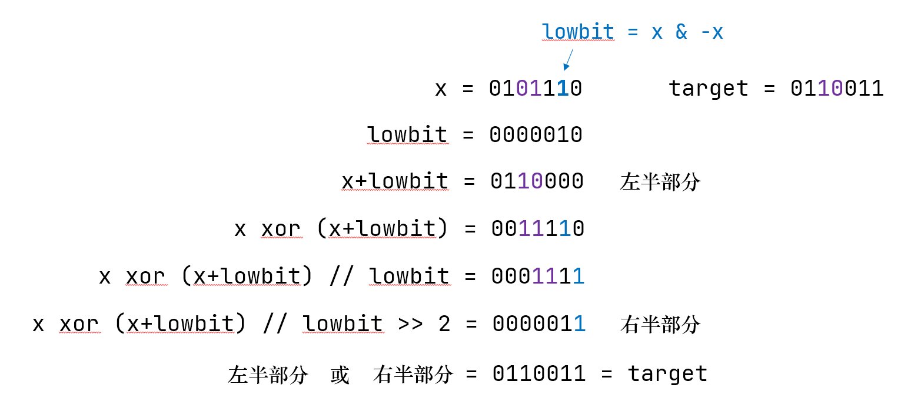

# LeetCode
My LeetCode Record

以下内容为我刷题时的随手笔记。格式较乱，随便看看就好。

[toc]

# 有用的链接

[try-jupyter](https://jupyter.org/try-jupyter/retro/tree)：jupyter官方的试用网站，可以自己新建一个ipynb，在里面试验各种语法，非常好使。
[灵茶山艾府的b站主页](https://space.bilibili.com/206214)：灵神yyds，每次周赛完必看他的复盘视频，无论是优化简单题的思路还是难题突破，收获很大。
[leetcode rating](https://zerotrac.github.io/leetcode_problem_rating/#/)：zerotrac（零神）搞的一个力扣题目分数评估的网站，原理是爬取每次周赛做出题目人的分数，来估计一个题目的难度系数。如果有时间，就按照rating和自己分数相近的题目开始刷。
[力扣刷题插件](https://leetcode.cn/circle/discuss/m3cCMG/)：结合零神的rating统计，可以把周赛中题目的rating直接显示在浏览器上，而不是简单、中等、困难这样区分。在做每日一题时使用效果尤其明显。
[Guardian & Knight 历史门槛分](https://leetcode.cn/circle/discuss/SKzRis/)：上瓜就图一乐。周赛稳定三题的话，Knight还是比较好上的。
[oi-wiki](https://oi-wiki.org/)：对于初学者而言，一些语法知识如果不熟悉的话，可以翻看oi-wiki（比如线段树）。当然了oi-wiki可能写的也会杂乱一些，但贵在比较系统。如果oi-wiki的模板啃不下去的话，~~可以结合力扣具体题目的评论区，或是灵神的b站一些周赛题目。哦不对，~~ 看本文档就行。

# split()与split(' ')：

split()会对包括`\n`等一切空字符一视同仁，而split(' ')则使用一且仅一个空格作为分隔符。

做如下判断：
```python
print('a b'.split() == 'a b'.split(' '))
print(''.split() == ''.split(' '))
```

显然，第一个判断会返回True，事实上结果都是`['a', 'b']`；但第二个结果却应该是False，因为空字符也会被分割判断，即：

```python
print(''.split()) # -> []
print(''.split(' ')) # -> ['']

print('a b'.split()) # -> ['a', 'b']
print('a\nb'.split()) # -> ['a', 'b']
print('a b'.split(' ')) # -> ['a', 'b']
```

注意，没有`'a'.split('')`这种东西，会报错empty separator。

# 树的前、中、后序遍历模板

- 首先是递归写法：

以后序遍历为例
```python
arr = []

def postOrder(root: TreeNode) -> None:
    if not root: # 递归边界
        return
    postOrder(root.left)
    postOrder(root.right)
    arr.append(root.val) # 访问节点，做一些操作

postOrder(root)
return arr
```

前中后序英文分别对应preOrder、inOrder、postOrder。注意，**当回溯时需要用到历史信息**，则考虑使用nonlocal做一些全局变量，或是通过list来做记录，进行后续操作。

无论是前中后序遍历，在对值进行操作时如果return，也会立即回溯而终止整个遍历。

函数的主体部分也可以简写成：
```python
def postOrder(root: TreeNode) -> None:
    if root:
        postOrder(root.left)
        postOrder(root.right)
        arr.append(root.val)
```
不过上一种方式更加清晰。知道就好。

- 迭代写法：

迭代写法的主体框架是：
```python
stack = []
cur = root
while stack or cur:
    while cur:
        stack.append(cur)
        cur = cur.left
    cur = stack.pop()
    cur = cur.right
return ans
```

树的遍历，总的原则是**先左后右**，所以每当向右时，都要重新判断是否需要先向左这件事——这个核心逻辑，决定了遍历这个过程，在向右时总是小心翼翼，必须“步步为营”。

看代码，while cur的部分属于向左探，本质上是 **「先访问再压栈」** ；后面pop和=right的部分，则是元素出栈后向右探，本质上是 **「再访问一次，并进入下一级右孩子（然后重新判断是否向左）」** 。

所以，先中后序在代码的何部分对元素操作、输出就比较有意思了，大致总结为：
1. 先序在第一次访问压栈前就操作；
2. 中序则在入栈出栈之间的访问；
3. 后序则比较棘手了，需要维护一个prev，确保右孩子访问过，才执行操作（必须区分我是向后执行右探操作呢，还是该直接对当前元素操作）。

----

前序
```python
ans = []
stack = []
cur = root
while stack or cur:
    while cur:
        ans.append(cur.val)
        stack.append(cur)
        cur = cur.left
    cur = stack.pop()
    cur = cur.right
return ans
```
        

中序
```python
ans = []
stack = []
cur = root
while stack or cur:
    while cur:
        stack.append(cur)
        cur = cur.left

    cur = stack.pop()
    ans.append(cur.val)

    cur = cur.right
return ans
```

后序（注意两点，一是右探时，对自身不操作，还要重新压栈回去等后续操作；二是对当前元素操作后，记得先记录pre为当前结点，后必须将当前结点赋空，以免再度判断操作，两者的顺序不能反）

```python
ans = []
stack = []
cur, prev = root, None
while stack or cur:
    while cur:
        stack.append(cur)
        cur = cur.left
    cur = stack.pop()
    if cur.right and prev != cur.right:
        stack.append(cur)
        cur = cur.right
    else:
        ans.append(cur.val)
        prev = cur
        cur = None
return ans
```

# nonlocal，global与作用域搜索顺序

当我们在python中访问某一对象时，其会根据L-E-G-B的作用域（scope）搜索顺序去寻找这一变量。其中，“LEGB”依次为：
- Local，局部作用域，例如某个函数、lambda表达式中。此作用域包含了当前函数下的所有变量内容，且这些变量只在函数被调用时产生（而非def时），理论上被调用多少次就产生多少个local scope。
- If the local scope is an inner or nested function, then the enclosing scope is the scope of the outer or enclosing function
- Enclosing，包含作用域，如果Local域处于**一个**函数的内部或是被包装的函数，那么其外围或者包含它的函数，就是Enclosing作用域。例如某个def1中有个def2，def2是L，那么def1就是其E。如果嵌套的函数更多，就应该有更多级的E。建议理解为介于L与G之间。
- Global，全局作用域，这个好理解，就是整个script下的空间，是整个python脚本最高级、最外围的一层。
- Built-in，内建作用域，这个一般不会涉及，属于是加载python脚本时就被自动加载的内容，例如abs，min，max这些内建函数等等，但这也侧面提醒我们在命名变量时尽量不要和这些内建函数名重叠。

寻找的顺序便是，**如果L找不到，就向上逐级地找E，再找不到就找G，直到B**。

举个例子就明白了，如下演示了一个L向上找E再向上找G的例子：
```python
from math import *
a = -1 # G空间
def f1(): 
    # E空间
    def f2():
        # L空间
        print(a) # L里没有，E也没有，G找到了
    f2()

f1() # -> -1
```
B在寻找变量时一般不会涉及，但注意设置变量名时尽量避开一些关键字，例如下面的代码就会报错（因为变量名检索时G中的max是优先于B的，所以max被认为是一个int型变量）：
```python
max = -1
arr = [1,5,3]
print(max(arr))
```

---

以上内容仅仅是变量名访问，那么当我们不想按照这样的优先级去检索变量，或是要修改外部变量值的时候，就会用nonlocal和global关键字。

- nonlocal只能应用在L访问**和修改**E中变量的情况下；通俗地讲，nonlocal只能逐级地向上访问是否存在该变量，直到找到或找不到为止，且上级作用域不能是G。
- global则用于**定义**、访问和修改G中的变量。
- 注意，使用nonlocal时，其所有的上级E中必须有相关的变量先定义好才能被nonlocal调用，global则不必在G中预先定义，可以在global之后新定义（但不能直接修改值）。nonlocal x意为“找到更上级的x，我要修改他”，而global x则好像是在说“我接下来对x的操作是全局性的”。
- 无论是nonlocal还是global，Local中都不得实现定义同名的变量（但使用global时，E可以有同名变量）。
- 无论是nonlocal还是global，都是为了将**不可变类型的数据变为自由变量**，对于可变变量就没必要使用了，比如list等。究其根本，可能是因为局部变量都会产生新的地址，修改了值也就修改了地址，而list等添加新数值或修改时不改变其内存地址。

举个例子就比较清楚了：

```python
def scope_test():
    def do_local():
        x = 1 # 只存活于此方法中，如果写为x+=2会报错
    def do_nonlocal():
        nonlocal x
        x = 2
    def do_global():
        global x
        x = 3 # 如果此处写为x += 3也会报错，因为此时全局其实没有定义x，这里x=3才刚刚定义。
    x = 4
    do_local()
    print('do local:', x)
    do_nonlocal()
    print('do nonlocal:', x)
    do_global()
    print('do global:', x) # 全局变量x被修改，局部不变。
    
scope_test()
print('finally:', x)
```
运行以上程序将会输出：
```plain
do local: 4
do nonlocal: 2
do global: 2
finally: 3
```

对于list等结构，是不需要使用nonlocal或者global的，但也要注意因为其可变性，要活用切片或者`.copy()`规避，例如：

```python
a1 = []
a2 = []
b = []
c = 1
def test():
    global c
    b.append(c)
    a1.append(b)
    a2.append(b[:]) # 此处也可以使用b.copy()
    c += 1

test()
test()
print(a1, a2)
```
并且，空列表也不能像`a = b = 1`这样来使用`a = b = []`赋值，例如下面的代码：
```python
a = b = []
c = d = 1
print(id(a), id(b))
print(id(c), id(d))
a.append(1)
b.append(2)
c += 1
d += 2
print(id(a), id(b))
print(id(c), id(d))
print(a, b)
```
输出：
```plain
57500352 57500352
8538880 8538880
57500352 57500352
8538904 8538928
[1, 2] [1, 2]
```

从输出可以看出，此时a、b两个列表被关联了。

另外，如果当前域在某个class中，并传入了self参数，也可以巧用self关键字通过使用self.xxx修改其属性来尽可能避免频繁使用nonlocal。【好吧我摊牌了，可以说专治LeetCode题了】

---

以上内容提到了闭包，即“能够读取外部函数内的变量的函数”，但这个似乎不太重要，关于闭包更多可见：[Python闭包（Closure）详解](https://zhuanlan.zhihu.com/p/453787908)

其他参考资料：[Python中的global关键字，你了解吗？](https://zhuanlan.zhihu.com/p/111284408)，[Using the LEGB Rule for Python Scope](https://realpython.com/python-scope-legb-rule/#:~:text=Enclosing%20(or%20nonlocal)%20scope%20is,define%20in%20the%20enclosing%20function.)


# 如何让tuple/list的对应元素相加？

可以通过`list(map(sum, zip(list1, list2)))`来达成，tuple同理。zip操作是对输入的每个对象enumerate并行封装，例如：
```python
list1 = [0,1,2]
list2 = [3,4,5]
list3 = [6,7,8]
list(zip(list1,list2,list3))
```
输出`[(0, 3, 6), (1, 4, 7), (2, 5, 8)]`

这个封装过程是tuple，返回zip对象，还要再转。map也是返回map对象，再转即可。

注意，函数的返回如果写`return a, b`实际上是返回的tuple`(a, b)`。

# *arg和**arg

作为函数调用时，\*用于解包tuple对象，\*\*用于解包dict对象。
这样比较抽象，比如
```python
strs = ["aaa", "bbb", "ccc"]
```
`zip(*strs)`等同于`zip("aaa", "bbb", "ccc")`（把list中的元素复制过来），然而不等同于`zip(strs)`或者`zip(strs[i] for i in range(3))`或者`zip(i for i in strs)`或者`zip(tuple(strs))`，最后总是差一层tuple（有趣的是，这四个表达式输出结果是相同的)。

当我们需要zip一个list本身的时，我们不能总是把其元素复制，或是手敲出来吧，这时使用\*就比较巧妙了。

而\*\*用于将一个dict对象转化为`key=value`的形式，例如`params={'x':1,'y':2,'z':3}`，那么`**params`就意味着`x=1, y=2, z=3`可以用于传参。根据具体的使用方式可见[Python中的*（星号）和**(双星号）完全详解](https://blog.csdn.net/zkk9527/article/details/88675129)

# itertools库的使用

[「Python」Python 标准库之 itertools 使用指南](https://blog.csdn.net/qq_43401035/article/details/119253871)、[Python 3 Library for itertools](https://docs.python.org/3/library/itertools.html)

## 两两捉对：pairwise

`pairwise(iterable)`，可以创建一个迭代对象的两两一组迭代；若元素少于2个则返回empty。使用时通常可以`for i, j in pairwise(obj)`比如"abc"就会产生"ab", "bc"。

## 物以类聚：groupby

`groupby(iterable, key=None)`，对一个迭代器（通常是字符串）根据关键字进行迭代分组。简单地说就是揪出一个人，看看它的成分（传入一个keyfunc，返回一个键值key），如果当前元素和前面的人是一个成分就放到同一组里，否则根据当前这个人的成分新开一个组，继续向后寻找。

【此段太细节可不看】具体一些，其在迭代时的底层逻辑是：
1. 首先初始化一个currkey（当前键）和tgtkey（目标键）都为空对象；随后开始遍历。
2. 如果当前键与目标键相同，获取当前的value（*以防是最后一次遍历，将会except跳出*）；否则将目标键赋为当前键；（*如此，在遍历第一个元素时必然更新当前键*）
3. 向后遍历，将当前键与目标键相同的所有元素放到一个grouper对象里，当前键与目标键不同时停止并返回key与group对象。
4. 不断循环2-3，直到无法获取当前键值（遍历至末尾）终止遍历。


于是，key参数**传入的是一个函数**。在不输入key时默认为恒等映射函数（`lambda x:x`），否则你需要定义一个函数`def(x): return key`，返回的key的数据类型不限。

在使用时我们通常写为`for key, grp in groupby(obj)`，但注意此时grp是一个_grouper对象，如果需要进一步使用请转为list。

举个例子：
```python
for key, grp in itertools.groupby("111334"):
    print(key, list(grp))
# ->
# 1 ['1', '1', '1']
# 3 ['3', '3']
# 4 ['4']
```

```python
div_size = lambda x: 'small' if x < 3 else 'medium' if x == 3 else 'big'
for key, grp in itertools.groupby([1,2,3,4,5,1,3,4,5], key=div_size):
    print(key, list(grp))
# ->
# small [1, 2]
# medium [3]
# big [4, 5]
# small [1]
# medium [3]
# big [4, 5]
```

可以看出，其和SQL中的GROUP BY并不同，python这里是不会合并前面后边key相同的组，而是按序输出；SQL则会合并这些key相同的组。

## 排列组合：combinations, permutations
- `combinations(iterable, r)`，其中iterable是一个可迭代的对象，r为数量，即在iterable中选出r个作为组合（默认按原顺序排列）。这样的语句可以快速地完成$C_n^r$的操作，很方便。 
- `permutations(iterable, r=None)`，有组合自然也就有排列，如果不给出r默认全长排列，给出r时相当于完成了$A_n^r$的操作。有些需要暴力搜索的时候会很好使。

## 前缀和、前缀数组：accumulate

`accumulate(iterable, func=operator.add)`能够自动帮我们计算好前缀和，甚至可以计算前缀积、前缀最值等。当不传入func时默认计算前缀和，也可以自定义一个函数`def(x, y)`用于计算两个迭代对象之间的关系，如乘法、max函数等等，可以实现自定义的前缀功能。

注意：
- 返回的时accumulate对象，必要时需要用list()进行转换。
- 其内部源码使用的是next方法，所以返回的对象第一个元素，对应着原iterable的第一个元素。（这很好地让前缀和默认了0，前缀积默认了1，都很好使，但有些情况需要特殊考虑）

<!-- # 对称情况

当出现对称情况时，复制代码是一件很蠢的事情，有时候可以试试交换输入，把f(a, b)变成f(b, a) -->

# sort与lambda函数

考虑一个list如`arr = [10, 8, 7, 2, 5, 9, 1]`。在python内置的sort之后他将会变成`[1, 2, 5, 7, 8, 9, 10]`，有如下一些细节：

- arr.sort()是内置的method，是一个过程，对原对象直接修改，并不返回任何值；
- sorted(arr)，顾名思义，则是对arr进行排序，返回是排列好的对象，而不对原对象修改。
- sort函数提供了许多选项。sort默认升序排序，可以使用`reverse=True`来实现降序排序；可以使用`key=`来制定比较的规则。

然后核心就是一定要学会**使用key这个关键字**。

## lambda函数

看似高深莫测，实则非常简洁：即不必显式地定义函数名称，而直接实现函数的功能。使用方式为`lambda x: f(x)`例如：

```python
g = lambda x: x ** 2
g(4) # -> 16
```

这里lambda之后并不一定只是一元，也可以是多元的。此外，其还可以与诸多内置函数并用，如：

```python
# 过滤三的倍数
foo = [2, 18, 9, 22, 17, 24, 8, 12, 27]
print(filter(lambda x: x % 3 == 0, foo))
# -> [18, 9, 24, 12, 27]

# 对list进行函数映射
print(map(lambda x: x * 2 + 10, foo))
# -> [14, 46, 28, 54, 44, 58, 26, 34, 64]
```

lambda函数也可以与defaultdict等数据结构共同使用，在传入参数时不做设定表示默认，如：

```python
x = defaultdict(lambda:0) # 默认值是0
y = defaultdict(lambda:[0,0,0]) # 默认值是列表
z = defaultdict(lambda: defaultdict(lambda:0)) # lambda函数也可以嵌套
```

## sort中的比较规则

- key关键字指通过什么样的比较规则来进行比较排序。其接受的是一个function，或是其他任何callable的参数（比如list，tuple等）。我们最常使用list来进行排序，例如：

```python
a = [1,2,3,4,5]
a.sort(key=lambda x: [x%2==0, x])
a # -> [1,3,5,2,4]
```

在通过lambda函数映射后，a对应的值为`[0, 1], [1, 2], [0, 3], [1, 4], [0, 5]`。这些list比较时也遵从着升序的规律，于是此处sort可以被理解为“奇数放前面，若同为奇数则数值较小的放前面”。**由此我们可以通过key+lambda+list来制定多重的比较规则，十分好用**。

- 当然，当lambda函数并不方便时，我们也可以写一个函数方法传入key中，例如上述例子我们可以写为：
  
```python
a = [1,2,3,4,5]
def trans(x):
    return (1, x) if x % 2 == 0 else (0, x)
a.sort(key=trans)
a # -> [1,3,5,2,4]
```

虽然这样写有些画蛇添足，但对于一些更复杂的数据结构，我们可以完成更多的运算操作，最终返回元组/list即可。

- 也可以直接传入一些常用的函数方法，如：

```python
a = ["This", "is", "the", "greatest", "warrior"]
a.sort()
a # -> ['This', 'greatest', 'is', 'the', 'warrior']
a.sort(str.lower)
a # -> ['greatest', 'is', 'the', 'This', 'warrior']
b = ["123", "23", "34", "5"]
b.sort(key=int)
b # -> ['5', '23', '34', '123']
```

- 在早期的python中sort还有一个cmp关键字，用来传入排序时两两比较的规则（这一点与其他语言比较类似），但在python3中被废弃，但我们仍然可以通过functools.cmp_to_key，来制定好规则后再传入key参数中使用。

在使用时，我们定义一个`def rule(x, y)`，我们可以默认x要排在y前面，那么这时利用我们想要的规则返回一个负值即可。**cmp默认负值代表小于，正值代表大于**。例如我们实现默认的升序排序，这里给出**一个错误示范**：

```python
# 一个错误的版本
a = [3,5,1,2,4]
def rule(x, y):
    if x < y:
        return -1
a.sort(cmp=rule)
```

这里有两处错误：1，python3已经废除了cmp关键词，必须通过前面提到的functools转换；2，如果 x >= y，这里是没有返回值的，在比较时就变成了None和int比显然比不了，也即必须所有的比较情况都能返回一个正值、负值或0。改写后如下：

```python
# 正确版本
import functools
a = [3,5,1,2,4]
def rule(x, y):
    if x < y:
        return -1
    elif x > y:
        return 1
    else:
        return 0
a.sort(key=functools.cmp_to_key(rule))
```

当然，可以简写为：
```python
import functools
a = [3,5,1,2,4]
def rule(x, y):
    return x - y
a.sort(key=functools.cmp_to_key(rule))
```

在实际使用中，**可以把x，y想象成排序后的两个对象，并想办法使其返回负值即可，如果使用if-else则要注意不要漏掉什么情况不返回值。**


参考资料：[Python排序sorted()函数里cmp_to_key和cmp](https://zhuanlan.zhihu.com/p/505195096)

# 经典排序总结

参考资料：[排序算法总结](https://www.runoob.com/w3cnote/sort-algorithm-summary.html)

## lowb三人组

冒泡，选择，插入。时间复杂度均为$O(n^2)$

- 冒泡排序就像泡泡浮起来，所以说是两两比较，把小的放到前边大的放后边，典型场景就是**小时候排队，两两互比身高站前后**；
- 选择排序是每次找到序列中最小的一个放在前面，很像冒泡，也像是排队，但像是老师给安排队伍，**从全局来看而非两两比较**；
- 插入排序典型场景就是**打扑克揭牌**，每揭一张我们就插入到本就有序的牌堆中，保持其有序性至终止。

## 高级三人组

快排，归并，堆。时间复杂度均为$O(nlogn)$

- 快速排序简言之就是分治+pivot，但在具体实现上，可以通过双指针查找。一般来讲我们选择第一个数为pivot（或理解为把pivot放在最前面），所以**开始时要从后向前查找**，挖坑填数。性能受制于pivot取得好不好，差时退化为选择排序，所以可以通过随机化改进。
- 归并排序亦作二路归并，是典型的二分分治法，分即将一个数组的排序问题二分为两个，治则采用**双指针合并之**。
- 堆排序则像是**官职制度**，省长管市长，市长管区长，能者擢升，不能者下放，从而达到整个队列的有序化。

## 其他排序

希尔排序、桶排序、基数排序

- 希尔排序可以看做是对插入排序的改进（在lowb三人组中，插入排序是比较好的），初始设置一个gap=length/2（最初Shell声称的版本，后续还有其他的gap计算方式），以gap为步长进行两两比较地插入排序，然后逐渐缩小gap，故亦称**缩小增量排序**。这样做仍然达不到$O(nlogn)$，但是可以减少插入排序的长程交换，最终复杂度改善至$O(n^{1.3\sim2.0})$。关于希尔排序的图解可以参见[菜鸟教程](https://www.runoob.com/data-structures/shell-sort.html)。
- 桶排序的思想就比较简单了，**一个萝卜一个坑**，开一个很大的内存，你是几就放在第几个，因此内存开销较大且受制于极端数字，但是时间上是O(n)
- 基数排序则在桶排序的基础上进行改进，即**先比个位再比十位百位**，依次得到大小关系。

高级三人组参考代码：

- 随机化快排
```python
class Solution:
    def randomizedPartition(self, nums, left, right):
        pivot = random.randint(left, right)
        nums[right], nums[pivot] = nums[pivot], nums[right]
        i = left
        for j in range(left, right):
            if nums[j] < nums[right]:
                nums[i], nums[j] = nums[j], nums[i]
                i += 1
        nums[right], nums[i] = nums[i], nums[right]
        return i
    
    def randomizedQuicksort(self, nums, left, right):
        if left >= right:
            return
        index = self.randomizedPartition(nums, left, right)
        self.randomizedQuicksort(nums, left, index - 1)
        self.randomizedQuicksort(nums, index + 1, right)
        
    def sortArray(self, nums: List[int]) -> List[int]:
        self.randomizedQuicksort(nums, 0, len(nums) - 1)
        return nums
```

- 归并排序
```python
class Solution:
    def merge_sort(self, nums, left, right):
        if left == right:
            return
        mid = (left + right) // 2
        self.merge_sort(nums, left, mid)
        self.merge_sort(nums, mid + 1, right)
        i, j = left, mid + 1
        temp = []
        while i <= mid or j <= right:
            if i > mid or (j <= right and nums[i] > nums[j]):
                temp.append(nums[j])
                j += 1
            else:
                temp.append(nums[i])
                i += 1
        nums[left:right+1] = temp


    def sortArray(self, nums: List[int]) -> List[int]:
        self.merge_sort(nums, 0, len(nums) - 1)
        return nums
```

- 堆排序

```python
class Solution:
    def maxHeapify(self, heap, heaplen, p): # 大根堆sift函数
        # 先找到左右子节点更大的那一个，再比较
        while p*2+1 < heaplen:
            left, right = p*2+1, p*2+2
            if right < heaplen and heap[right] > heap[left]: # 右子节点未越界且右大于左，交换右
                nex = right
            else: # 右子节点越界或右小于左
                nex = left
            if heap[nex] > heap[p]:
                heap[nex], heap[p] = heap[p], heap[nex]
                p = nex
            else:
                break
    
    def heapsort(self, heap):
        n = len(heap)
        # 建堆要从第一个非叶子结点到根节点遍历sift调整
        for i in range(n // 2 - 1, -1, -1):
            self.maxHeapify(heap, n, i)
        # 排序：交换首尾，每次区间长度-1，对heap[0] sift调整
        for heaplen in range(n - 1, 0, -1):
            heap[0], heap[heaplen] = heap[heaplen], heap[0]
            self.maxHeapify(heap, heaplen, 0)

    def sortArray(self, nums: List[int]) -> List[int]:
        self.heapsort(nums)
        return nums
```

# 二分查找与bisect

## bisect模块基础

参考资料：[python官方文档 - bisect](https://docs.python.org/3/library/bisect.html)

bisect模块可以省略去写二分查找的过程。查找一般使用`bisect.bisect_left(a, x, lo=0, hi=len(a))`，这里默认a是sorted。bisect_left与bisect_right（等价于bisect）的区别在于，若a中存在对应的value，是插到左边还是右边。

注意插入的过程是指，将x插入返回的位置i后，原[i:]的元素向后移一位，仍保持有序性。

e.g.：

```python
import bisect
a = [1, 4, 6, 6, 8, 20]
bisect.bisect_left(a, 6)
bisect.bisect(a, 6)
bisect.bisect_right(a, 6)
```
上述三条分别返回2，4，4。

如果想找到位置之后再插入，可以一步使用`insort_left`，或是`insort_right`（等价于`insort`）。但要注意，二分查找的过程是$O(\log n)$的，插入这个操作却是$O(n)$的，算复杂度时记得考虑插入操作。

## 什么时候使用二分查找

- 当给定的数组呈有序性（或是时间复杂度允许我们先进行$O(n\log n)$的排序），并且在一个确定的界限内进行查找时，就可以使用二分查找。所以这样问题的核心是：**有序、查找**。
- 当出现 最小化最大值、最大化最小值 这样的字样时，也是非常典型的二分答案。我们可以二分查找最值，然后模拟当前值为最值时是否可行。此时我们可以将理解为二分理解为，以一个$O(\log n)$时间复杂度的代价换取了一个条件（最值等于某值），这样问题就被简化了许多。

典型例题：[875. 爱吃香蕉的珂珂](https://leetcode.cn/problems/koko-eating-bananas/)、[剑指 Offer 53 - II. 0～n-1中缺失的数字](https://leetcode.cn/problems/que-shi-de-shu-zi-lcof/)、[2439. 最小化数组中的最大值](https://leetcode.cn/problems/minimize-maximum-of-array/)

## 更高级的key映射查找

在python 3.10之后，还增加了key关键字，即bisect函数变为了`bisect_left(a, x, lo=0, hi=None, *, key=None)`，可以配合lambda函数等方式快捷地使用。具体地，是将x插入到a经过key映射后的位置。所以请注意，**必须保证a在经过key的映射后仍然是升序的，否则比较会出错**。而且与a不同，这个x又是key映射后的，所以说实际使用时key会经常写成一个布尔的判断函数，然后x是True或者False以找到插入的位置。

再具体可以看[源码](https://github.com/python/cpython/blob/3.10/Lib/bisect.py)对于使用key的比较过程。


# 关于浮点精度问题

参考资料：[【灵茶山艾府】第 294 场力扣周赛精讲 + 算法练习方法分享](https://www.bilibili.com/video/BV1RY4y157nW)、[IEEE 754](https://en.wikipedia.org/wiki/IEEE_754)

本以为python不会溢出，但还是在294周赛中中招了。python3的int（整数）是可以非常非常长的，所以不用担心；但float64的精度（C++中的double）只能到10^16左右(1 << 53)，所以当出现`1/(10**9-1)和1/(10**9-1)`作差时，分母相乘溢出。

总之，一切除法比较尽量转化成乘法比较！


# 拓扑排序

参考资料：[OI WIKI 拓扑排序](https://oi-wiki.org/graph/topo/)、[【拓扑排序】图论拓扑排序入门](https://mp.weixin.qq.com/s?__biz=MzU4NDE3MTEyMA==&mid=2247489706&idx=1&sn=771cd807f39d1ca545640c0ef7e5baec)

总的来说，拓扑排序是用来描述变量与变量之间的上下级关系的算法，可以梳理变量的依赖关系，因而称为“排序”。典型模板题就是A比B大，C比D大，A又比C大……然后排一个总的次序。


算法的核心思想则是在一个DAG中，维护一个入度为 0 的顶点的集合。将变量视为图的结点，那么找到所有入度为0（没有边指向它）的顶点，删去其所有指出的边，然后重复此过程。若出现某一时刻没有没有入度为0的点，说明图中有环。因此，拓扑排序也很适合结合DFS或BFS（更推荐BFS），Kahn算法就是BFS下的toposort。

# random

## 基础工具
  
python自带的随机库是random。

1. 生成整数随机数：randint(start, stop)，或者randrange(start, stop+1)，两者等价，前者左闭右闭，后者左闭右开，start和stop都是整数。
2. 生成浮点随机数：uniform(x, y)，左闭右闭！
3. 生成0-1的随机数：random()，这个是左闭右开，相当于是[0,1)
4. 从序列返回一个随机元素：choice(seq)。要求序列非空，否则indexError。
5. 从序列返回多个随机元素：choices(seq, weights=None, cum_weights=None, k=1)。同样要求序列非空（和k的大小无关）。注意choices可以按权重（list格式）或者累计权重来抽样，某些情况下很好使。另外注意choices返回的是list(list())。k=1的时候需要[0]一下。
   
更多细节可以参见：[python官方文档 - random](https://docs.python.org/3/library/random.html)。

## 水塘抽样

码住，遇到再写

# @staticmethod

声明，不强制要求传递参数的静态方法。[Python staticmethod() 函数](https://www.runoob.com/python/python-func-staticmethod.html)


# 集合set、字典dict

## 一般用法

集合`s = set()`是一个无重复元素的「池子」。注意，不要指望set中元素的有序性，如果你真的需要一个有序的set，请使用sort（$O(n\log n)$的时间复杂度），或者退而使用堆（如果只需维护一个大/小根堆而不要求全部有序，建堆只需要$O(n)$）。

字典的定义方式`d = dict()`和`d = {}`等价。collections库中的defaultdict、Counter也可以认为是一个字典。

`d = defaultdict(type)`可以设置值（注意，不是键）的类型和初始值，结合前文提到的lambda函数，还可以灵活地修改其默认初值。

`d = Counter()`则是一个计数器，用于统计元素出现次数时很好使，值的默认类型是int，初值为0。某种程度上相当于defaultdict(int)，但Counter可以直接传入数组，得到其次数的统计结果。

## 添加、删除

- set通过`.add()`方法添加元素，也可以在初始化时输入一个iterable进行元素添加，如list、str等。如果想添加多个元素，可以使用`.update(iter)`方法，类似于对列表extend。
- set通过`.remove()`方法或是`.discard()`方法移除指定元素，区别是前者在元素不存在时会报错，后者不会。
- dict直接通过对键赋值的方式添加元素，如`d['a'] = 2`，如果是defaultdict则可以直接使用+=一类的操作而不会报错；
- dict也可以采用setdefault方式，对已存在键值进行特判地赋值，如：

```python
d = {}
d.setdefault(key1, a)
d.setdefault(key1, b)
```

那么`d[key1]`应该会输出a。setdefault的含义是，对某一键值尝试复制，若存在该键则不做改变，若不存在该键则赋值。这个操作很适合对“存在性”做记录，省去了一些if else的麻烦。

- dict通过`del d[key]`删除key键值，及其对应的值。

## 遍历

- 对set的遍历，默认为其元素。
```python
s = set('132')
s.add('a')
for i in s:
    print(i, end=' ')
# -> a 1 3 2
```

- 对字典的遍历，默认为其键值。如果需要对键-值同时遍历，请使用`.items()`方法。如果想单独访问键或者值，可以使用`d.keys()`或者`d.values()`。尽量避免使用`for key in d.keys()`这种用法，因为对字典的遍历默认就是键值。
```python
d = dict()
d[1] = 'c'
d[2] = 'b'
for key in d: # 等价于 for key in d.keys()
    print(key, end=' ')
for key, val in d.items():
    print(key, val, end=' ')
# -> 1 2 1 c 2 b
```


# 优先队列、堆
参考资料：[Python标准库模块之heapq](https://www.jianshu.com/p/801318c77ab5)

此库即优先队列，也即（小根）堆，处理一些流式添加、并维护递增/减性的问题较为好使，时间复杂度在$O(\log n)$。如需使用大根堆可以对list取负。用法：

- 建堆：`heapify(list)`，或使用heappush对空列表逐个添加元素。注意使用heapify时是不会return list的，这应该是一个单独的语句。heapify的时间复杂度是$O(n)$（应该是）
- 添加元素：`heappush(list, a)`，对list添加a元素，要求list是一个已经建好的堆。如果list不是堆，就直接塞到末尾了。由于添加元素后需要调整，所以时间复杂度是$O(\log n)$
- 弹出元素：`heappop(list)`，弹出堆顶元素并调整堆，返回堆顶元素的值。同样如果list不是堆，也是直接弹出列表第一个元素。同样地，时间复杂度也是调整所需时间$O(\log n)$

# 单调栈/单调队列
<!-- 
单调栈/单调队列旨在维护一个递增/递减数组的下标，注意几点：
- 因为其是不断前出后进的，一般要用双向队列 -->

单调栈旨在维护一个单调序列的栈结构，一个比较典型的问题就是，求解某个列表每个数对应的**左/右侧最近的那个小于/大于**它的数的**位置**。

举个例子，比如我们求解`arr = [6,7,5,2,4,9,3]`中每个元素对应左侧最近的小于它的数字位置，若不存在则返回-1，那么目标答案应该是`ans = [-1,0,-1,-1,3,4,3]`，我们维护的单调栈状态应该是：

- 初始为空
- 考虑第一个数字6，初始为空表明不存在比其更小的数字，故**将6的下标0入栈**，对ans添加-1
- 考虑下一个数字7，栈顶下标对应数字为6比7小，继续**将7的下标1入栈**，对ans添加栈顶元素0
- 5比栈顶对应数字7小，栈弹出1；继续比较，5仍比栈顶对应数字6小，弹出0，；此时栈空表示没有更小的数字，将下标2入栈，同时对ans添加-1
- 下一个数字2比栈顶对应数字5小，栈弹出

注意几点：
- 一般来讲，**单调栈维护的是下标**，不是数字，但并不绝对，要看题目的需求。
- 如果维护的是下标，那么单调栈的“单调”，保证的是栈中下标所对应数字的单调性。
- 如果**需要双向，就搞两个单调栈**，一个维护左侧最值（从0到n遍历），一个维护右侧最值（从n-1到-1遍历），这不影响时间复杂度。
- 单调栈的时间复杂度看起来难算，但从遍历的角度来考虑，每个数字必然入栈一次、出栈一次，所以时间复杂度是$O(n)$。
- 当维护左侧最近值时，栈空我们要补-1；当维护右侧最近值时，栈空我们要补n。这个也叫做「哨兵」，可以*理解为*在-1或是n位置（分别对应左侧、右侧）有一个无穷小的数（如果要维护递增单调栈）。

代码实现的几个要点：
- 不必显式地定义哨兵，令栈初始为空即可，因为即使你定义了-1或是n也照样要判断。
- 记录的数组lefts/rights最好先定义好，再修改值，这样写起来会方便一些。如果使用append，在维护右侧时，最终得到的rights数组是“逆向”的。
- 在循环遍历时，如果要维护左侧最近值就顺序遍历，维护右侧则为倒序；
- 循环内部，首先对栈顶做while判断，如果要维护严格递增栈，那么意味着栈顶要小于当前值，此时pop的条件就应该是对小于取反，即大于等于的都pop。其他情况以类似的逻辑推断。
- 当栈空，顺序补-1，倒序补n。

典型例题：[84. 柱状图中最大的矩形](https://leetcode.cn/problems/largest-rectangle-in-histogram/)

参考代码（以维护nums数组右侧最近更小值为例）：
```python
n = len(nums)
st = []
rights = [0] * n
for i in range(n-1, -1, -1):
    while st and nums[st[-1]] >= nums[i]:
        st.pop()
    rights[i] = st[-1] if st else n
    st.append(i)
```

进阶：[2289. 使数组按非递减顺序排列](https://leetcode.cn/problems/steps-to-make-array-non-decreasing/)（截止2022年11月，力扣周赛史上最难第三题）

# @cache

此机制源自于functools的lru_cache，在python 3.9之后，其直接被集成在python中，名为cache。我们通常通过装饰器的方式使用之（即对def前添加`@cache`），如果python版本过低，也可以通过`import functools`后`@functools.lru_cache`使用。

缓存机制可以可以将函数调用的结果存入缓存中，从而在再次递归调用时达到复用效果，对像斐波那契数列一类问题的递归解法时有着加速和避免内存爆掉的作用，**广泛应用于记忆化搜索即DP问题**。注意函数的输入尽量是单值变量/元组，对输入是list、dict等结构时不适用。

例如当我们计算斐波那契数列f(5)时，函数被实际调用的次数：
```python
cnt = 1
def f(x):
    global cnt
    print("call %d by f(%d)!" % (cnt, x))
    cnt += 1
    if x == 1: return 1
    if x == 2: return 1
    return f(x-1) + f(x-2)

print(f(5))
```
输出：
```plain
call 1 by f(5)!
call 2 by f(4)!
call 3 by f(3)!
call 4 by f(2)!
call 5 by f(1)!
call 6 by f(2)!
call 7 by f(3)!
call 8 by f(2)!
call 9 by f(1)!
5
```
但是当我们加入cache机制后：
```python
cnt = 1
from functools import cache
@cache
def f(x):
    global cnt
    print("call %d by f(%d)!" % (cnt, x))
    cnt += 1
    if x == 1: return 1
    if x == 2: return 1
    return f(x-1) + f(x-2)

print(f(5))
```
输出变为了：
```plain
call 1 by f(5)!
call 2 by f(4)!
call 3 by f(3)!
call 4 by f(2)!
call 5 by f(1)!
5
```

于是我们就可以递归地写DP和记忆化搜索题了。


参考资料：[Python 缓存机制与 functools.lru_cache](http://kuanghy.github.io/2016/04/20/python-cache)，[Python 中 lru_cache 的使用和实现](https://www.cnblogs.com/zikcheng/p/14322577.html)，[Python缓存lru_cache的介绍和讲解](https://quniao.blog.csdn.net/article/details/120726050)

# DP、记忆化搜索

## 动态规划

DP有两个关键性质：最优子结构、重叠子问题。

- 最优子结构：一个问题的最优解包含其子问题的最优解。
- 重叠子问题：问题的递归算法会反复地求解相同的子问题，而不是一直生成新的子问题

如果一个问题具备这两个性质，那么就可以尝试用DP去解决它。根据这两个性质，解决DP问题的关键/流程便是：
1. 以变量定义问题，如“将前k个字符串分为长度大于等于L的i段”等，便于理清头绪；
2. 寻找问题与其子问题之间的递推式，也就是我们常说的“状态转移方程”；
3. 寻找递归的边界条件/初始条件。

DP的代表题目是：[53. 最大子数组和](https://leetcode.cn/problems/maximum-subarray/)、[300. 最长递增子序列](https://leetcode.cn/problems/longest-increasing-subsequence/)

DP本身并不难，难的主要是结合剪枝、优化，这就比较考验基本功了。


## 记忆化搜索

记忆化搜索比较像是DFS与DP的产物，即在DFS时记录状态对应的信息，以达到减少重复搜索、剪枝的目的。我们常用二进制表示来作为状态的记录，例如：
- 当搜索位数有10位时，我们就可以使用10个0（也就是0）作为一个mask，表示所有位置都可以被搜索；
- 当搜索过（使用过）某一位时，将mask的该位置置0（`mask |= 1 << j`，使用或运算的好处是，即使此位已经为1，此语句仍然令其为1）；
- 这样我们判断例如第j位（从0开始）能否使用时，就可以判断`mask >> j & 1`来判断此位是否可以使用，等于1时不可用，等于0时可用。
- 另外，左右移的优先级比、异或、或的优先级要高，但比加减乘除低，使用时要注意。

参考资料：[百度文库 - 动态规划原理](https://wenku.baidu.com/view/ecf0156bf4ec4afe04a1b0717fd5360cba1a8d0d.html)

# 数位DP

数位DP的本质还是记忆化搜索，通常用于解决给你一个n，和一些条件，问满足这些条件的1-n之间的数有多少个。从1开始枚举的话往往要超时，所以可以从数位的角度出发，以期在某些条件重叠时利用DP达到优化。

主要有四个参数：
- i表示枚举的数位，这个必须有；
- mask可选，用于记录已经使用过哪些数字，如果题目没有这方面要求就不必有mask，有时也可以是一个布尔变量；
- isLimit表示当前是否为临界值，如给定的n是1234，如果枚举的第一位是1，第二位讨论是isLimit就要设为True，因为其枚举范围被限制在0~2之间；相应地如果第二位为2，进入第三位讨论时isLimit仍要保持为True，以此类推；
- isNum表示是否有先导零，或者表示是否跳过此位，设置为False时表示跳过（此时不为合法数字），有前导零，设置为True表示是一个数字，此后不可跳过。当题目对前导零不限制时也可以没有此变量。

模板：
```python
@cache
def dp(i: int, mask: int, isLimit: bool, isNum: bool) -> int:
    # 终止条件
    if i == len(s):
        return int(isNum) # 一直跳返回0，没有跳过返回1
    
    res = 0
    if not isNum: # 【只有在前边都跳过的时候】才能继续跳过，否则就是补0了
        res = dp(i+1, mask, False, False)
    
    # 开始枚举，首先找出枚举上限和下限
    up = int(s[i]) if isLimit else 9
    down = 0 if isNum else 1
    for j in range(down, up+1):
        if mask >> j & 1 == 0:
            res += dp(i+1, mask|(1<<j), j == up and isLimit, True)
    return res

return dp(0, 0, True, False) # 外部，从初值进入
```
- mask不是必须的，要根据题目条件的含义变化
- 其他语言dp时可以不必对isLimit和isNum存储，只要对i和mask dp即可。

# 二叉搜索树

- 一个二叉搜索树的中序遍历是递增的。
- 我问你，在二叉搜索树中查找一个数（不存在返回-1）的时间复杂度是多少？你可能会想当然地回答$O(\log n)$，因为二叉搜索树都给你建立好了，就像二分查找一样。然而不是，因为**二叉搜索树最坏情况是一条单链，查找复杂度是$O(n)$**。注意，只有平衡的时候才是$O(\log n)$，否则都应该视为$O(n)$。

# lowbit，树状数组

lowbit即找到从低位起数，第一个1；相对地也有highbit，意为从高位往低位数第一个1。

## Gosper's Hack

这是一个搜索算法，用于解决在n位中选取m位做一些操作的问题。我们固然可以使用itertools.combinations之类的库来完成，但是代码不甚简洁，这里可以**使用位运算**来达到快捷枚举的目的。

通过位运算来表示枚举位的核心问题是，如何通过当前枚举数找到下一个枚举数。例如，我们从7位中选取4位，则考虑一个8位二进制数，1表示选取，0表示不选取，那么一种朴素的枚举方式便是从低位全1（“0001111”）枚举到高位全1（“1111000”）。那么，假如当前枚举到了“0101110”，如何找到下一个枚举数呢？（答案应该是“0110011”）

Gosper's Hack解决的就是此问题，思路是找到右起第一个“01”将之变为“10”，然后让其右侧（低位）的所有1都右移到最右侧（即右侧有几个1就从右起补几个1）。

我们可以通过lowbit来实现从“01”到“10”这个进位过程，只要给x补充一个lowbit即可。求解lowbit的方式是`x & -x`这个一定要记住。于是`x + lowbit`便形成了目标答案的左半部分。如何得到右半部分呢？只要x与左半部分异或，就可以得到右半部分和进位的“01”、“10”此处的两个异或得到的1。



具体的计算过程如上图所示，考虑一个n位中选取m位的问题，总结为：

- 先计算lowbit：`lowbit = x & -x`
- 再计算左边：`left = x + lowbit`
- 再计算右边：`right = (x ^ left) // lowbit >> 2`
- 左右结合得到下一值：`tgt = left | right`
- 开始枚举遍历，初始值是`(1 << m) - 1`，终止值可以设定为`1 << n`。

参考资料：[【力扣双周赛 86】位运算黑科技 | 单调队列 | LeetCode 算法刷题](https://www.bilibili.com/video/BV1na41137jv/?vd_source=35801b0cdcf955efe0e9b490935ab8ca)

例题：[2397. 被列覆盖的最多行数](https://leetcode.cn/problems/maximum-rows-covered-by-columns/)，参考代码（另，注意将list of int转换为二进制对应数的技巧语句）：
```python
class Solution:
    def maximumRows(self, matrix: List[List[int]], numSelect: int) -> int:

        mask = [sum(val << i for i, val in enumerate(row)) for row in matrix]

        n = len(matrix[0])
        x = (1 << numSelect) - 1
        ans = 0
        while x < (1 << n):
            cnt = sum([line & x == line for line in mask])
            ans = max(ans, cnt)
            lb = x & -x
            left = x + lb
            right = (x ^ left) // lb >> 2
            x = left | right
        return ans
```

# 快速幂

考虑一个求x的n次幂的问题。有点类似于钱币凑钱的问题——一个十进制数可以通过对若干个二进制数进行取与不取的抉择，得到一个0与1组成的二进制数；而此处求幂，我们构造了“基底”为$x^1, x^2, x^4...$，取与不取的加和操作由指数映射变为了相乘操作，由此便可以在$\log n$时间内拆解问题。

具体的实现上，我们可以：
- 设置一个res=1作为返回答案
- 通过n & 1 == 1判断此位“基底”x是否需要与res相乘
- 对x * x作为下一组基底，此后循环判断

参考题目：[剑指 Offer 16. 数值的整数次方](https://leetcode.cn/problems/shu-zhi-de-zheng-shu-ci-fang-lcof/)，参考代码：
```python
class Solution:
    def myPow(self, x: float, n: int) -> float:
        if x == 0: return 0
        res = 1
        if n < 0: x, n = 1 / x, -n
        while n:
            if n & 1: res *= x
            x *= x
            n >>= 1
        return res
```

# 并查集


